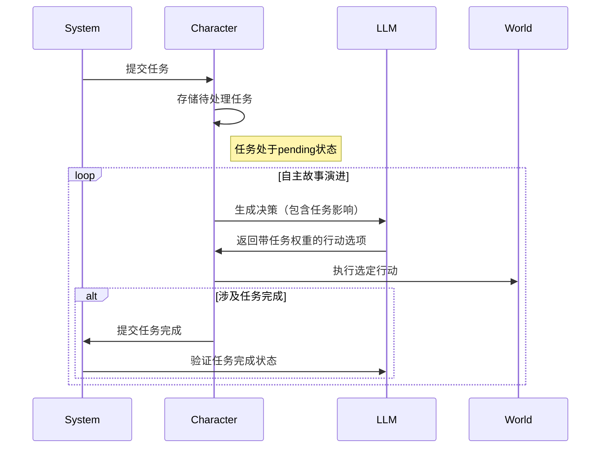

游戏概述：玩家扮演系统，故事由LLM进行驱动，玩家通过扮演系统发布任务，修改世界情况（帮助主角提升等级，给予主角特定物品，授予特定功法等工作），引导主角达成目标（玩家自己拟订的，或者由游戏预先设计的）

### 一、核心类结构
1. **System（系统控制器）**
   - 方法：
     - `async modify_world(modification: str)`：修改世界状态（消耗动态计算的能量）
     - `async confirm_world_state(query: str)`：查询世界状态（消耗能量）
     - `create_task(description: str, reward: str)`：创建新任务对象
     - `async communicate(message: str)`：与主角直接对话
     - `async advance_story()`：触发自主故事演进

2. **Character（主角代理）**
   - 方法：
     - `async generate_actions()`：生成三个候选行动方案（含任务影响）
     - `async receive_task(task: Task)`：接收任务并存储
     - `get_current_thoughts()`：获取当前心理活动

3. **World（世界模型）**
   - 方法：
     - `apply_change(change_prompt: str)`：应用世界变更
     - `get_current_context()`：获取当前完整世界状态
     - `log_history(event: str)`：记录历史事件

4. **Task（任务对象）**
   - 属性：
     - description：任务目标描述
     - status：pending/accepted/rejected
     - influence：对主角决策的影响权重
     - reward：完成奖励描述
   - 方法：
     - `apply_influence(context: dict)`：将任务影响注入决策上下文

5. **LLMService（大模型服务）**
   - 已实现方法：
     - `async generate_response(prompt: str)`：核心生成接口
   - 新增方法：
     - `async calculate_energy_cost(action_type: str, context: str)`：计算能量消耗

### 二、核心流程修正
1. 特殊指令处理：
```python
async def handle_command(command: str):
    # 故事演进指令
    if command.startswith("/story"):
        story_output = await system.advance_story()
        return story_output
    
    # 任务生成指令
    elif command.startswith("/task"):
        task_description = command[5:].strip()
        if not task_description:
            return "请输入任务描述"
        
        # 格式化任务和奖励描述
        task_description = await LLMService.format_task(task_description)
        
        # 玩家确认是否创建任务

        # 创建任务
        task = system.create_task(description=task_description, reward=reward)
        return f"任务已发布：{task.description}\n奖励：{reward}"
    
    # 修改世界指令
    elif command.startswith("/modify"):
        modification = command[7:].strip()
        if not modification:
            return "请输入修改内容"
        
        # 检查修改能量消耗，由玩家确认或取消修改世界

        # 检查能量并执行修改
        result = await system.modify_world(modification)
        return result
    
    # 查询世界状态指令
    elif command.startswith("/query"):
        query = command[6:].strip()
        if not query:
            return "请输入查询内容"
        
        # 检查查询能量消耗，由玩家确认或取消查询状态

        # 检查能量并执行查询
        result = await system.confirm_world_state(query)
        return result
    
    # 获取主角心理活动指令
    elif command.startswith("/thoughts"):
        thoughts = system.character.get_current_thoughts()
        return f"主角当前心理活动：\n{thoughts}"
    
    # 查看系统能量指令
    elif command == "/energy":
        return f"当前系统能量：{system.energy}"
    
    # 直接对话指令（默认）
    else:
        if not command.strip():
            return "请输入有效指令"
        
        # 与主角直接对话
        response = await system.communicate(command)
        return f"主角回复：{response}"

```

2. 任务影响机制：


### 三、关键设计说明
1. **动态能量计算**：
```python
async def modify_world(self, modification: str):
    energy_cost = await LLMService.calculate_energy_cost(
        action_type="modify",
        context=f"修改内容：{modification}\n当前能量：{self.energy}"
    )
    if self.energy >= energy_cost:
        self.energy -= energy_cost
        return await self.world.apply_change(modification)
```

2. **一致性维护实现**：
```python
class World:
    async def apply_change(self, change_prompt: str):
        self.history.append(new_state)
        self.character.update()
```

3. **任务影响机制**：
```python
class Character:
    async def generate_actions(self):
        task_context = "\n".join([t.description for t in self.pending_tasks])
        prompt = f"""
        [待处理任务]
        {task_context}
        
        [角色档案]
        {self.profile}
        
        请生成三个候选行动方案，考虑任务影响但不强制服从, 格式如下：
        ACT1= 
        ACT2=
        ACT3=
        """
        return await LLMService.generate_response(prompt)
```

### 四、MVP阶段实现范围
1. **核心功能闭环**：
   - 系统干预（修改/查询/沟通）
   - 自主故事演进（/story指令）
   - 动态能量系统
   - 基础任务框架

2. **技术边界**：
   - 世界状态以纯文本形式维护
   - 无持久化存储（单会话运行）

3. **验证重点**：
   - 干预行为与自主演进的平衡
   - 任务影响决策的自然性
   - 能量消耗机制的合理性

该设计保持核心循环的完整性，同时通过LLMService抽象层实现技术细节隔离，为后续扩展预留接口。